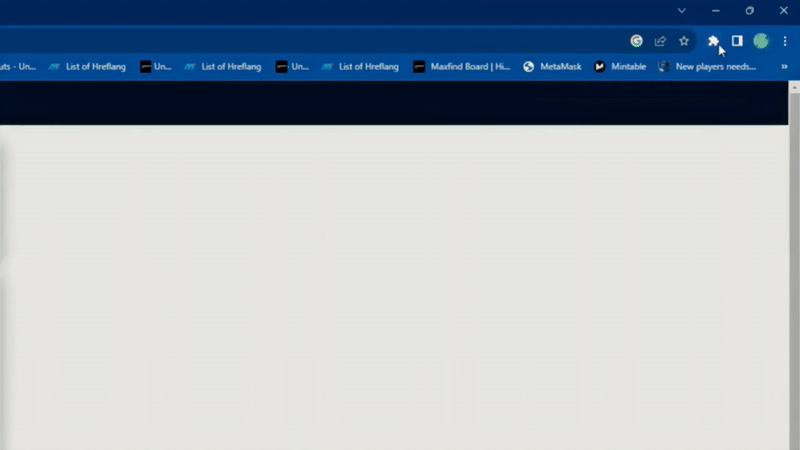

# CopyRight+: Enable Right-Click & Copy

A powerful Chrome extension designed to revolutionize your browsing experience by enabling right-click and copy functionalities on restricted websites and extracting text from images.

Chrome Audio Capture is available in the [Chrome Store](https://chrome.google.com/webstore/detail/copyright%20-enable-right-c/pkoccklolohdacbfooifnpebakpbeipc)

## What Will Our Chrome Extension Look Like?

# Features

1. Enable Copy and Highlight: Effortlessly copy text and highlight content on web pages.
2. Re-enable Context Menu: Regain access to the right-click context menu for a seamless browsing experience.
3. Remove Copytext Protection: Bypass restrictions set by websites to prevent copying text.
4. CopyRight+ Mode: A robust mode to remove various types of protection against advanced methods disabling copy-paste functionality.
5. Image Reader (OCR): Extract text from images using Optical Character Recognition.

# How To Use

1. Installation: Begin by installing the CopyRight+ extension from the respective browser store.
2. Accessing the Options: After installation, click on the extension icon located in the top-right corner of your browser.
3. Choosing the Mode: In the popup, select between three options: “Enable Copy,” “CopyRight+ Mode,” or “Image Reader (OCR).”
4. Ready to Copy: Post selecting your desired mode, start copying text from any website or image seamlessly.

# Developer's Corner

Interested in knowing how we built CopyRight+? Dive deep into our development journey:
How do I Make a Chrome Extension to Enable Right-Click Functionality
